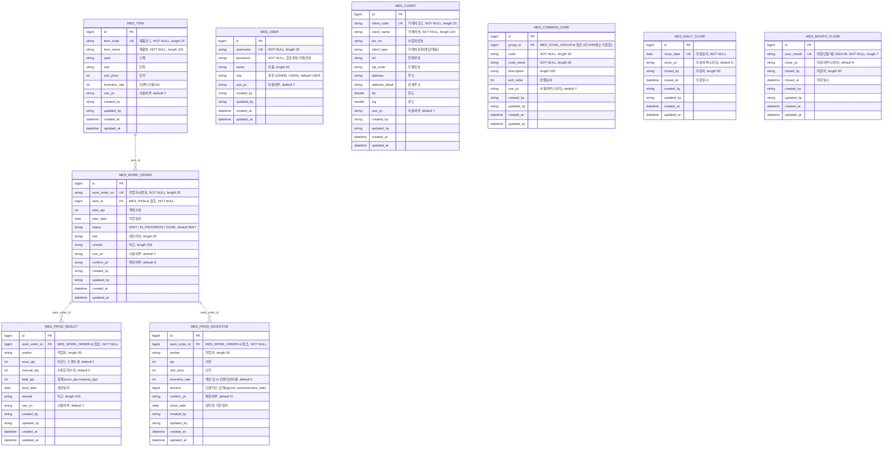

# MES (제조실행시스템) 프로젝트

## 프로젝트 소개
- MES(제조실행시스템, Manufacturing Execution System) 포트폴리오 프로젝트입니다.
- 자동차 엔진 부품 생산관리 시스템을 주제로 설계했습니다.
- TMS(운송관리시스템) 실무 경험을 바탕으로, 생산 현장의 실적/작업지시 흐름을 반영해 설계했습니다.

## 배포 URL
- https://mes-frontend-zoyo.vercel.app

## 테스트 계정
| 구분 | 아이디 | 비밀번호 |
| --- | --- | --- |
| 관리자 | admin | admin123 |
| 게스트 | guest | guest123 |

## 기술스택
**백엔드**: Spring Boot, JPA, MyBatis, PostgreSQL, JWT, Spring Security

**프론트**: React, AG Grid, Chart.js, axios

## 주요 기능
- 기준정보 관리 (품목, 거래처)
- 작업지시 관리 (등록, 작업시작, 작업마감)
- 생산실적 입력 (바코드 스캔, 수동입력)
- 작업실적현황 및 일마감
- JWT 기반 로그인/권한 관리
- 공통코드 관리
- 사용자 관리

## ERD

`src/main/java/com/mes/mes_project/entity` 하위 JPA Entity를 기준으로 작성했습니다.

## 관계 설명
- **MES_ITEM (1) : MES_WORK_ORDER (N)** — 작업지시는 하나의 품목을 참조 (`item_id`)
- **MES_WORK_ORDER (1) : MES_PROD_RESULT (N)** — 생산실적은 하나의 작업지시에 귀속 (`work_order_id`)
- **MES_WORK_ORDER (1) : MES_PROD_INCENTIVE (N)** — 인센티브는 하나의 작업지시에 귀속 (`work_order_id`)
- **MES_COMMON_CODE → MES_CODE_GROUP** — `group_id`로 코드그룹을 참조하지만, 요청 범위(9개 테이블)에 포함되지 않아 이 ERD에서는 컬럼만 표기하고 관계선은 생략했습니다.
- **MES_USER, MES_CLIENT, MES_DAILY_CLOSE, MES_MONTH_CLOSE** — 다른 테이블과 직접적인 FK 관계 없이 독립적으로 운영됩니다. (`created_by`/`updated_by`는 사용자 아이디를 문자열로만 기록하며 FK가 아닙니다)
- **MES_PROD_INCENTIVE.close_date** — `MES_DAILY_CLOSE.close_date`와 논리적으로 연결되는 값이지만, DB상 FK 제약으로 걸려있지는 않습니다.

## 화면 스크린샷
(추후 추가)
